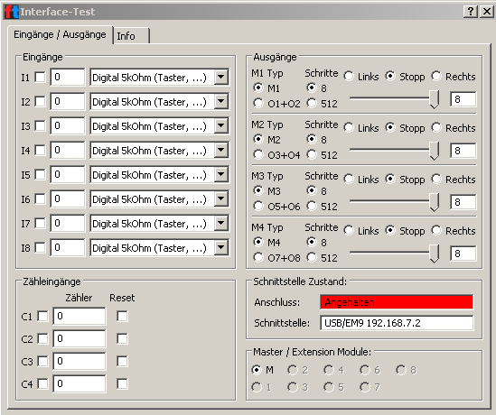

> If you have any questions, please contact us: fischertechnik-technik@fischer.de

# TXT Repair Batch Files (>= 4.4.3)
This repository contains batch files to repair the TXT firmware.

> **DO ONLY USE THIS BATCH FILES, IF THE TXT FIRMWARE IS DEFECTIVE!**

## First Steps
- Download and unzip [txt_repair](https://github.com/fischertechnikGmbH/txt_repair/archive/master.zip) to your Windows computer
- Connect the TXT controller via USB and power on the TXT controller
- Execute corresponding batch file(s) 

## Problems
### Problem "Angehalten" or "Stopped"
- TXT role "Extension" does not work (green LED does not light up)
- After update with ROBOPro 4.4.3 the interface test shows "Angehalten" or Stopped" in the window:

#### Solution
1. Execute 0_new_root.bat to show and write down the root password
2. Execute 1_repair_FwUpdTxt.bat to repair IO firmware of TXT controller

## Batch Files
### 0_new_root.bat
Create and Show root password on TXT display

### 1_repair_FwUpdTxt
Repair Motor IO Firmware
