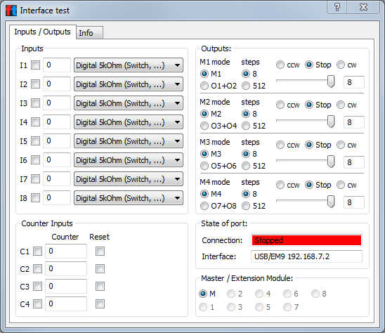
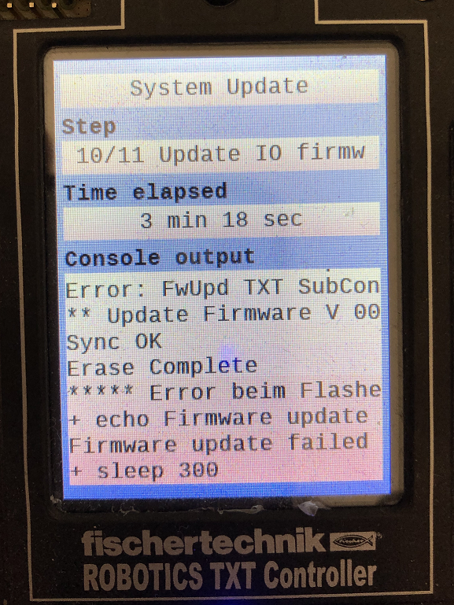

# Problem after update with ROBOPro >=4.4.3 "Stopped" or "Angehalten" in Test Interface Window
After update with ROBOPro >=4.4.3
- TXT role "Extension" does not work (green LED does not light up)
- the interface test shows "Angehalten" or Stopped" in the window:

# Solution
Repair Steps
1. If TXT firmware version >=4.4.4, please activate SSH in the settings of TXT controller

`Settings -> Arrow down -> Security -> SSH Daemon` **-> ON**

2. Download and unzip the [batch files](https://github.com/fischertechnik/txt_repair/archive/master.zip)

3. Execute `0_new_root.bat` to show and write down the root password from TXT controller display, Hint: Please wait 30-60 seconds!

4. Execute `1_repair_FwUpdTxt.bat` to repair IO firmware of TXT controller
